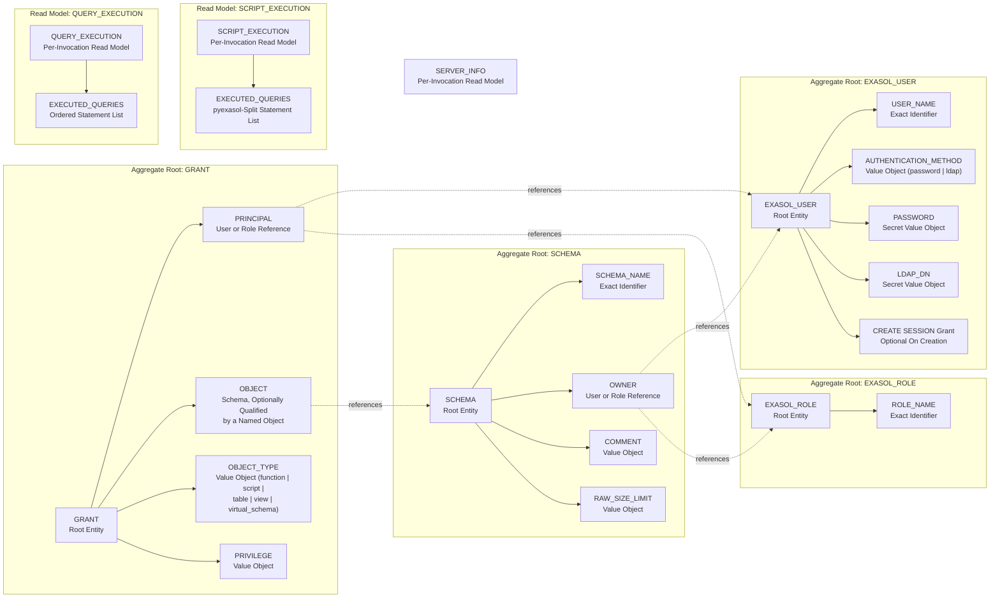
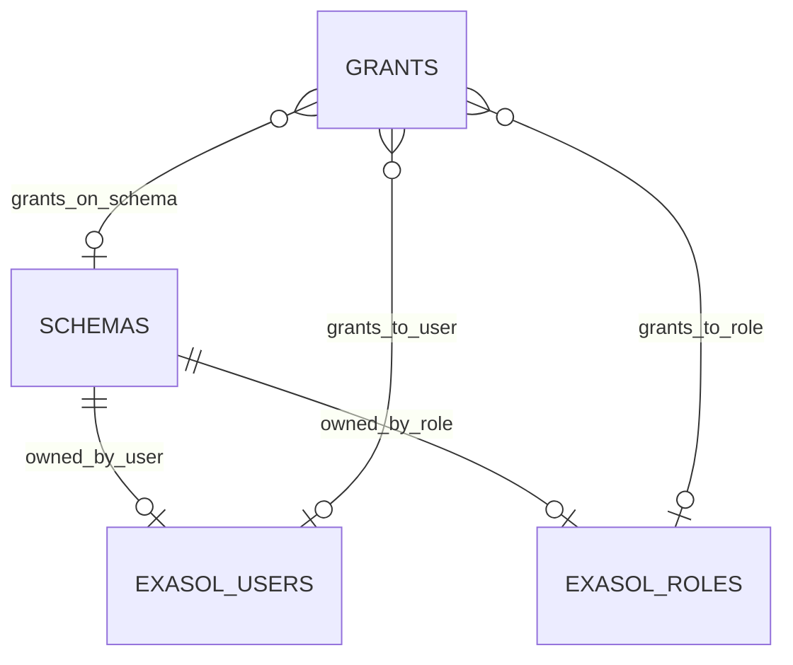

# Exasol Ansible Collection Entity Model

The Exasol Ansible Collection automates two kinds of Exasol interaction. `exasol_query` and
`exasol_script` are **direct-execution** surfaces: each run is a trusted-operator command that
executes operator-supplied SQL and reports what happened, with no persisted collection-owned
state. `exasol_schema`, `exasol_user`, `exasol_role`, and `exasol_grants` are **declarative
reconciliation** surfaces: each run observes real Exasol catalog state and plans the minimal
statements needed to move it toward the requested `state`, `owner`, `comment`, membership, or
privilege set. `exasol_info` is a **read-only** surface that never changes Exasol state.

`SCHEMA`, `EXASOL_USER`, and `EXASOL_ROLE` are independent aggregate roots: each is a Exasol
catalog object addressed by its own exact name, and each is reconciled from its own catalog view
(`EXA_ALL_SCHEMAS`/`EXA_SCHEMAS`, `EXA_ALL_USERS`, `EXA_ALL_ROLES`). `GRANT` is a distinct
aggregate whose identity is the tuple (principal, principal type, object, privilege); it
references `EXASOL_USER` or `EXASOL_ROLE` as the granted principal and, for object privileges, a
schema optionally further qualified by a named object (disambiguated by `object_type` when
supplied) as the granted object, but it does not own or cascade-delete those aggregates. A single
`exasol_grants` invocation reconciles a batch of such tuples at once, one per
`system_privileges` entry and per `object_privileges[].privileges` entry. `QUERY_EXECUTION` and
`SCRIPT_EXECUTION` are ephemeral
per-invocation read models, not persisted catalog objects: they exist only for the duration of one
module run and are re-derived from scratch on every call. `SERVER_INFO` is likewise a
per-invocation read model.

## Aggregate Boundary Diagram

## Entity Relationship Diagram

## Domain Entity attributes

Each section represents a domain entity rather than a specific technical artifact. 
The domain model is derived from the Gherkin acceptance scenarios,
and the code should express the same domain concepts.
The existing acceptance tests effectively define and shape the domain model described here.
However, this alignment is not currently enforced.

### SCHEMA

| Attribute | Description | Data Type | Validation Rules |
|-----------|-------------|-----------|------------------|
| schema_name | Exact schema identifier | String | Primary Key, exact identifier preserved as supplied |
| exists | Whether the schema currently exists | Boolean | Derived from `EXA_ALL_SCHEMAS`/`EXA_SCHEMAS` |
| owner | User or role that owns the schema | String / Reference | Optional; reconciled via `ALTER SCHEMA ... CHANGE OWNER` only when supplied and different |
| comment | Free-text schema comment | String / null | Optional; `null` clears the comment via `COMMENT ON SCHEMA ... IS NULL` |
| raw_size_limit | Storage quota | Integer / null | Optional; reconciled via `ALTER SCHEMA ... SET RAW_SIZE_LIMIT` only when supplied and different |
| new_name | Requested rename target | String | Optional; reconciled via `RENAME SCHEMA`; mutually exclusive with treating `schema_name` as the final name |
| cascade | Whether `DROP SCHEMA` may remove a non-empty schema | Boolean | Default `false`; a non-empty schema drop without `cascade` fails safely |

### EXASOL_USER

| Attribute | Description | Data Type | Validation Rules |
|-----------|-------------|-----------|------------------|
| user_name | Exact user identifier | String | Primary Key, exact identifier preserved as supplied |
| exists | Whether the user currently exists | Boolean | Derived from `EXA_ALL_USERS` |
| authentication_method | Login credential mechanism | Enum (`password`, `ldap`) | Optional; defaults to `ldap` when `ldap_dn` is supplied, otherwise `password` |
| password | Login secret | String (write-only) | Never returned in results or error messages; required to create or alter a user while `authentication_method` is `password` |
| ldap_dn | LDAP distinguished name bound to the user | String (write-only) | Never returned in results or error messages; required to create or alter a user while `authentication_method` is `ldap`; reconciled via `ALTER USER ... IDENTIFIED AT LDAP AS` only when different from the catalog's `DISTINGUISHED_NAME` |
| update_password | Password update policy | Enum (`on_create`, `always`) | `on_create` sets a password only while creating the user; `always` updates an existing user's password every run; not applicable to LDAP-authenticated users |
| create_session | Whether `GRANT CREATE SESSION` is issued alongside `CREATE USER` | Boolean | Default `true`; applies only while creating the user |
| cascade | Whether `DROP USER` may remove dependent objects | Boolean | Default `false` |

### EXASOL_ROLE

| Attribute | Description | Data Type | Validation Rules |
|-----------|-------------|-----------|------------------|
| role_name | Exact role identifier | String | Primary Key, exact identifier preserved as supplied |
| exists | Whether the role currently exists | Boolean | Derived from `EXA_ALL_ROLES` |
| cascade | Whether `DROP ROLE` may remove dependent grants | Boolean | Default `false` |

### GRANT

| Attribute | Description | Data Type | Validation Rules |
|-----------|-------------|-----------|------------------|
| principal | Granted user or role name | String | Foreign Key to `EXASOL_USER.user_name` or `EXASOL_ROLE.role_name`; supplied as the `user` or `role` option |
| principal_type | Whether `principal` is a user or a role | Enum (`user`, `role`) | Exactly one of `user` or `role` must be supplied per request; both together is rejected |
| system_privileges | Server-wide privileges (for example `CREATE SESSION`) | List<String> | Optional; checked against `EXA_DBA_SYS_PRIVS`; at least one of `system_privileges` or `object_privileges` is required |
| object_privileges | Batch of schema-scoped privilege requests | List<Object> | Optional; each entry reconciled independently against `EXA_DBA_OBJ_PRIVS` |
| object_privileges[].schema | Schema an entry's privileges apply to | String | Required per entry |
| object_privileges[].object | Object within the schema, unqualified name | String / null | Optional; omitted means the privileges apply to the schema itself |
| object_privileges[].object_type | Kind of the named object | Enum (`function`, `script`, `table`, `view`, `virtual_schema`) | Optional; disambiguates same-named objects of different kinds when `object` is set |
| object_privileges[].privileges | Object privileges to reconcile (for example `USAGE`, `SELECT`, `INSERT`) | List<String> | Required per entry |
| state | Desired grant state | Enum (`present`, `absent`) | `present` grants; `absent` revokes; applies to every requested privilege in the batch |

### QUERY_EXECUTION

Per-invocation read model produced by `exasol_query`.

| Attribute | Description | Data Type | Validation Rules |
|-----------|-------------|-----------|------------------|
| query | Requested statement or ordered statement list | String / List<String> | Required |
| positional_args | Values bound to `?` placeholders | List<Any> | Only valid for a single statement |
| named_args | Values bound to `:name` placeholders | Map<String, Any> | Only valid for a single statement |
| changed | Whether any executed statement was not read-only | Boolean | `false` when every statement is read-only |
| query_result | Rows from the last statement | List<Object> | Empty when the last statement has no result set |
| query_all_results | One result list per statement, in execution order | List<List<Object>> | Empty entries for statements without a result set |
| executed_queries | Statements executed, or predicted in check mode | List<String> | In check mode, empty unless the batch contains a write statement |
| rowcount | Per-statement affected/selected row count | List<Integer> | Empty in check mode |
| execution_time_ms | Per-statement execution time | List<Float> | Empty in check mode |

### SCRIPT_EXECUTION

Per-invocation read model produced by `exasol_script`.

| Attribute | Description | Data Type | Validation Rules |
|-----------|-------------|-----------|------------------|
| script | Requested multi-statement SQL script | String | Required; always a single string, never a list |
| changed | Whether any statement pyexasol executed was not read-only | Boolean | `false` when every split statement is read-only |
| query_result | Rows from the last executed statement | List<Object> | Empty when the last statement has no result set |
| query_all_results | One result list per statement pyexasol split from the script | List<List<Object>> | Empty in check mode |
| executed_queries | Statements pyexasol executed, in order | List<String> | In check mode, the whole supplied script as one entry instead of the real per-statement split |
| rowcount | Per-statement affected/selected row count | List<Integer> | Empty in check mode |
| execution_time_ms | Per-statement execution time | List<Float> | Empty in check mode |

### SERVER_INFO

Per-invocation read model produced by `exasol_info`.

| Attribute | Description | Data Type | Validation Rules |
|-----------|-------------|-----------|------------------|
| version | Exasol server version | String | Non-empty |
| database_name | Exasol database name | String | Non-empty |
| cluster_size | Number of nodes in the Exasol cluster | Integer | At least `1` |
| changed | Always `false` | Boolean | This use case never alters Exasol state |

## Aggregate Insight

`exasol_schema`, `exasol_user`, `exasol_role`, and `exasol_grants` reconcile independent
aggregates from observed catalog state and always predict the identical statement plan in check
mode that a real run would execute. `exasol_query` and `exasol_script` are direct-execution
surfaces over the ephemeral `QUERY_EXECUTION` and `SCRIPT_EXECUTION` read models: they are exempt
from the state-reconciliation rule and from automatic redaction of operator-supplied SQL text,
per `doc/design/security/tier_segregation_and_trusted_operator_boundary.md`. `exasol_script`
additionally defers all statement-splitting to upstream `pyexasol` (`execute_sql_script`) so the
collection never maintains a second SQL-script parser; its check mode is therefore coarser than
its real execution, predicting a non-read-only script as one opaque unit rather than the real
per-statement breakdown. `exasol_info` produces the `SERVER_INFO` read model without touching any
aggregate.
