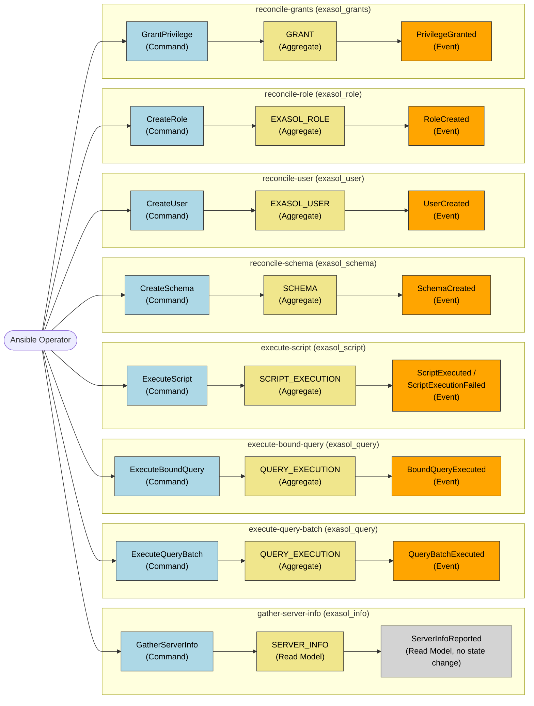
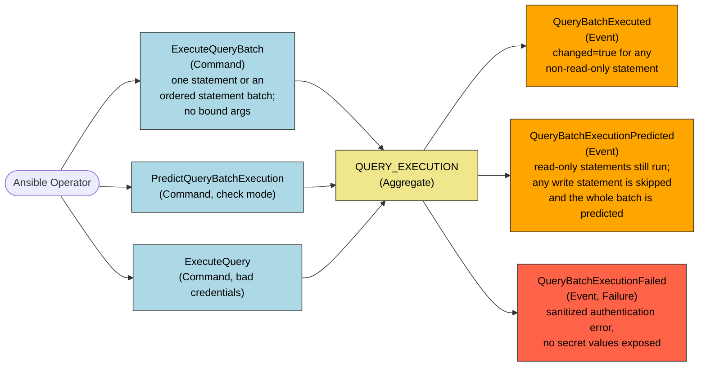
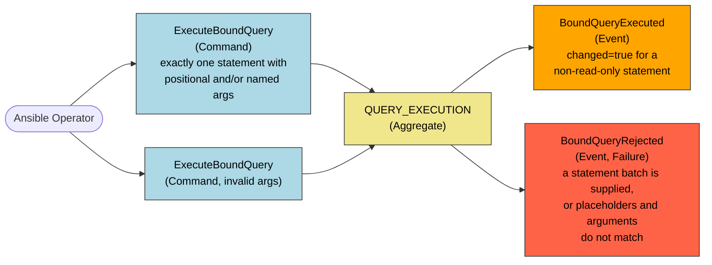
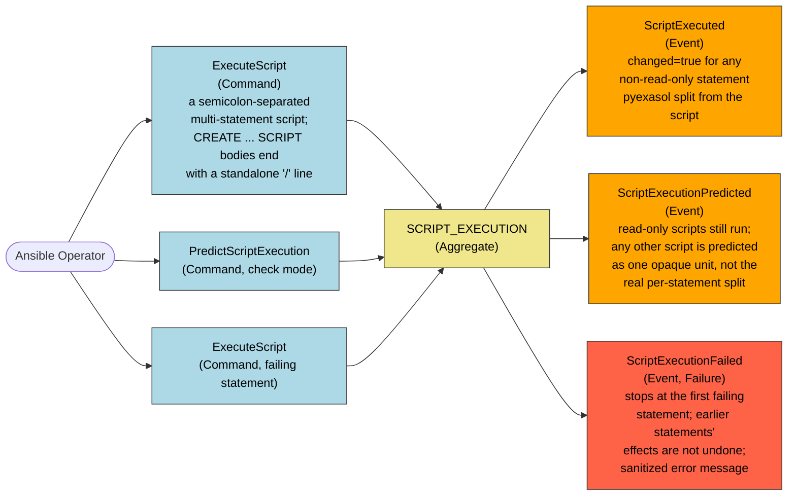
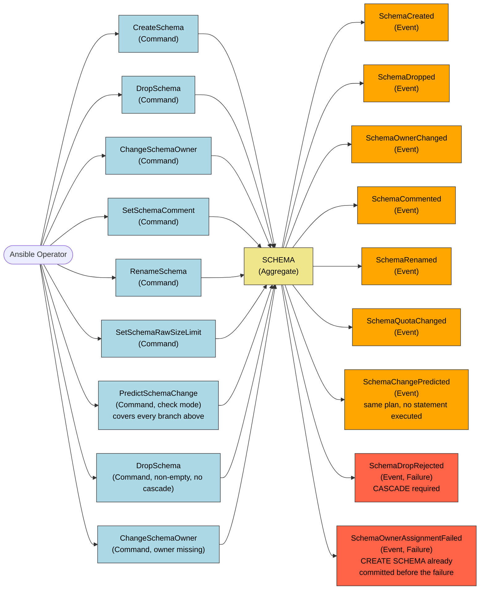

# Use Case EventStorming Diagrams

EventStorming diagrams for every use case discovered from the Gherkin scenarios in
`specs/ansible_modules` and `specs/ansible_playbook`: the Ansible Operator issues a **command**,
an **aggregate** applies it, and the aggregate produces an **event** (or a **read model**, for the
two surfaces that never change Exasol state) or a **failure**.

## Overview

One representative branch per use case. Detailed per-use-case diagrams below expand every
command/event branch a use case's scenarios exercise.

GRANT records reference `EXASOL_USER` or `EXASOL_ROLE` as the granted principal, and a schema or
table as the granted object.

| Color | Meaning |
|---|---|
| Light blue | Command: what the Ansible Operator asked for |
| Khaki | Aggregate: the consistency boundary that applies the command |
| Orange | Event: the fact recorded once the command is applied |
| Light gray | Read model: a query result with no state change |
| Tomato (per-use-case diagrams below) | Failure: a rejected or failed command |

## gather-server-info (`exasol_info`)

This use case never mutates Exasol state, so it has no domain event: only a read model is
produced.

Source scenario: [exasol_info.feature](../../../specs/ansible_modules/exasol_info.feature).

## execute-query-batch (`exasol_query`)

`ExecuteQueryBatch` accepts either one unbound statement or a list of statements. A list runs on
one connection in supplied order. `positional_args` and `named_args` are not accepted for this use
case because the module does not infer which statement should receive them.

Source scenarios: [exasol_query.feature](../../../specs/ansible_modules/exasol_query.feature),
[exasol_query.feature](../../../specs/ansible_playbook/exasol_query.feature) (`Execute statement batch on one connection` and
`Skip mixed read-write batch in check mode`).

## execute-bound-query (`exasol_query`)

`ExecuteBoundQuery` accepts one `query` statement only. It uses `positional_args` for `?`
placeholders and `named_args` for `:name` placeholders. Supplying either argument collection with
a statement batch is rejected before execution.

Source scenarios: [exasol_query.feature](../../../specs/ansible_playbook/exasol_query.feature) (`Bind positional arguments`,
`Bind named arguments`, and `Reject bound arguments for statement batch`).

## execute-script (`exasol_script`)

`ExecuteScript` never accepts `positional_args` or `named_args`: Ansible's own argument-spec
validation rejects them before the command reaches this aggregate, since pyexasol does not support
bound parameters for scripts.

Source scenarios: [exasol_script.feature](../../../specs/ansible_modules/exasol_script.feature),
[exasol_script.feature](../../../specs/ansible_playbook/exasol_script.feature).

## reconcile-schema (`exasol_schema`)

When the observed schema state already matches the requested state (existence, owner, comment,
rename, quota), the runtime issues no command and reports `changed=false`: an implicit "leave
unchanged" branch behind every command above.

Source scenario: [exasol_schema.feature](../../../specs/ansible_modules/exasol_schema.feature).

## reconcile-user (`exasol_user`)

`update_password=on_create` only sets a password while creating the user. For an existing
password-authenticated user, the runtime issues no password-update command and reports
`changed=false`; Exasol does not expose password equality for comparison. `update_password` does
not apply to LDAP-authenticated users.

`authentication_method` defaults to `ldap` when `ldap_dn` is supplied, otherwise `password`.
`create_session` (default `true`) makes the `CREATE SESSION` grant on user creation optional rather
than implicit.

Source scenarios: [exasol_user.feature](../../../specs/ansible_modules/exasol_user.feature),
[exasol_user.feature](../../../specs/ansible_playbook/exasol_user.feature).

## reconcile-role (`exasol_role`)

When the role already exists (for `CreateRole`) or is already absent (for `DropRole`), the runtime
issues no command and reports `changed=false`.

Source scenario: [exasol_role.feature](../../../specs/ansible_modules/exasol_role.feature).

## reconcile-grants (`exasol_grants`)

`GRANT` is keyed by (principal, principal_type, object, privilege). When the observed privilege
state already matches the requested state, the runtime issues no command and reports
`changed=false`.

A single `GrantPrivilege`/`RevokePrivilege` command reconciles a batch of such tuples at once: one
per `system_privileges` entry, and one per privilege in each `object_privileges[]` entry. Each
`object_privileges[]` entry names its own schema, an optional object, and an optional object_type
(`function`, `script`, `table`, `view`, or `virtual_schema`) that disambiguates same-named objects.

Source scenarios: [exasol_grants.feature](../../../specs/ansible_playbook/exasol_grants.feature).
