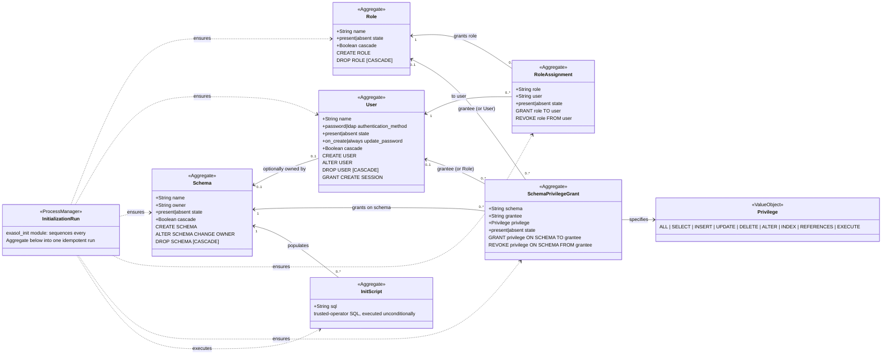

# Exasol Init — Domain Model Diagram

This is the static counterpart to
`specs/diagrams/exasol_init_process_diagram.md`: the Aggregates discovered by
EventStorming and how they relate, independent of execution order. Each
Aggregate is the consistency boundary for one Exasol object type; each
relationship is a real SQL dependency (a foreign concept in Exasol's own
catalog, not an artifact of this collection).

## Notes on the relationships

* `RoleAssignment` is the resolved many-to-many relationship between `Role`
  and `User` — it exists only once both sides exist (see the process
  diagram's first Policy join).
* `Schema.owner` is an *optional* 0..1 relationship to `User`: a schema is
  always owned by *someone* in Exasol (defaulting to the connecting admin
  account), but `exasol_init` only manages that relationship when `owner` is
  explicitly supplied.
* `SchemaPrivilegeGrant.grantee` can reference either a `User` or a `Role` —
  Exasol's `GRANT ... TO` target accepts either principal type, so the
  aggregate models `grantee` as a discriminated reference rather than two
  separate aggregates.
* `InitScript` has no `state` (present/absent): scripts are trusted-operator
  SQL in the same sense as `exasol_query` — they are executed, not
  reconciled, and are therefore append-only within one initialization run.
* `InitializationRun` is a **process manager**, not a persisted Exasol
  object. It has no row in any Exasol system table; its only observable
  trace is the sequence of events it drives through the aggregates above.
