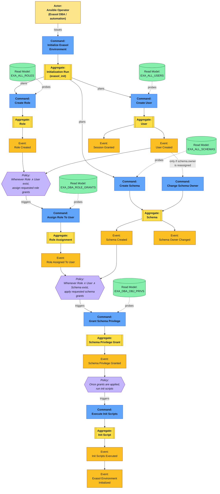

# Exasol Init — Process EventStorming Diagram

This diagram captures the Exasol environment-initialization process using
EventStorming notation: **Actors** (who triggers work), **Commands**
(orange, imperative — what an Actor asks for), **Aggregates** (yellow,
the consistency boundary that accepts a Command), **Events** (amber, past
tense — what happened), **Policies** (lilac, "whenever X then Y" reactions
that connect events to the next command), and **Read Models** (green, the
Exasol system-table projections used to decide *whether* a command has
anything to do).

It reflects the phase ordering implemented by the `exasol_init` module and
derived in `specs/glossary/exasol_init_glossary.md`:

1. **Role** and **User** creation are independent (no read-before-write
   dependency between them).
2. **Role Assignment** (`GRANT role TO user`) needs both a Role and a User to
   exist — a join point.
3. **Schema** creation is independent by default; it only depends on User
   creation when the schema's `owner` is being reassigned to an application
   user.
4. **Schema Privilege Grant** needs the Role/User *and* the Schema to
   exist — the second join point.
5. **Init Script** execution runs last, after the schema exists and the
   access-control model (both grant kinds) is in place.

## Reading the diagram

* **Parallel-safe swimlanes**: `Create Role` and `Create User` have no arrow
  between them — either can run first, or (conceptually) concurrently.
  `exasol_init` executes them sequentially over one connection (roles, then
  users) purely for deterministic output ordering, not because of a data
  dependency.
* **Conditional dependency**: the dashed edge from `User Created` to
  `Change Schema Owner` only fires when a `schemas[].owner` parameter is
  supplied and refers to a user managed in the same run.
* **Two join points (Policies)** are where the process genuinely cannot
  proceed until multiple aggregates exist: role assignment needs a Role and
  a User; schema-privilege grants need a Schema and a grantee (Role or
  User).
* **Init scripts are last** by policy, not just convention: they are
  trusted-operator SQL (same trust model as `exasol_query`) that assumes the
  access-control model is already in place.

See `specs/diagrams/exasol_init_domain_diagram.md` for the static aggregate
relationships, and `specs/glossary/exasol_init_glossary.md` for term
definitions.
